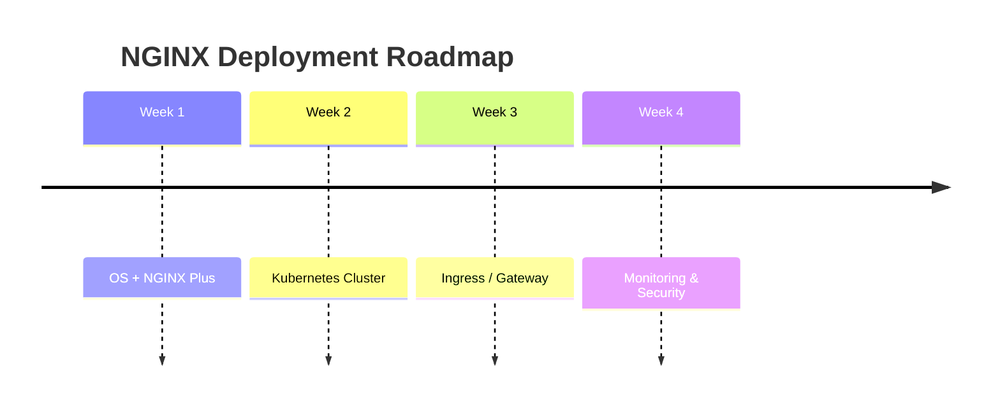

````markdown
<div align="center">

# 🚀 NGINX Plus & Gateway Fabric Installation Suite

### *Enterprise-Grade Application Delivery Infrastructure*


*A comprehensive toolkit for deploying and managing **NGINX Plus** and **NGINX Gateway Fabric (NGF)** in production Kubernetes environments.*

</div>

---

## 📊 Quick Navigation

| [🏗️ Architecture](#-architecture-overview) | [📚 Guides](#-documentation-guide) | [⚡ Quick Start](#-quick-start) | [🛠️ Tools](#-tools--technologies) |
|------------------------------------------|-----------------------------------|--------------------------------|-----------------------------------|

---

## 🏗️ Architecture Overview

```mermaid
graph TB
    subgraph "Infrastructure Layer"
        A[Ubuntu 22.04 Server] --> B[NGINX Plus Installation]
        B --> C[Kubernetes Cluster<br/>1 Master + 2 Workers]
    end

    subgraph "Ingress Solutions"
        C --> D1[Option 1: Nginx Ingress<br/>Open Source]
        C --> D2[Option 2: NGF<br/>Enterprise]
    end

    subgraph "Features"
        D1 --> E1[Basic Routing]
        D1 --> E2[SSL/TLS Termination]
        D1 --> E3[Load Balancing]

        D2 --> F1[Gateway API]
        D2 --> F2[Advanced Traffic Mgmt]
        D2 --> F3[Metrics & Monitoring]
        D2 --> F4[Security Policies]
    end

    E1 --> G[Production Applications]
    E2 --> G
    E3 --> G
    F1 --> G
    F2 --> G
    F3 --> G
    F4 --> G
````

---

## 📚 Documentation Guide

| Guide                                            | Description                         | Best For                 |
| ------------------------------------------------ | ----------------------------------- | ------------------------ |
| **Installing_NGINX_Plus_on_Ubuntu.md**           | NGINX Plus installation & licensing | SysAdmins, DevOps        |
| **KubernetesClusterInstallationGuide.md**        | 3-node Kubernetes cluster           | Infrastructure Engineers |
| **Kubernetes Nginx Ingress Controller Setup.md** | Open-source ingress                 | Developers               |
| **NGF-Installation-and-Testing.md**              | NGINX Gateway Fabric setup          | Platform Engineers       |
| **Advanced_NGF-Configuration-Guide.md**          | Traffic management & security       | Architects, SREs         |

---

## 🆚 Solution Comparison Matrix

| Feature        | Nginx Ingress | NGINX Gateway Fabric    |
| -------------- | ------------- | ----------------------- |
| License        | Open Source   | Commercial (NGINX Plus) |
| API            | Ingress       | Gateway API             |
| Load Balancing | Basic         | Advanced                |
| Monitoring     | Limited       | Enterprise-grade        |
| Security       | Basic TLS     | Policies & WAF-ready    |
| Best Use       | Dev / Test    | Production              |

---

## 🚀 Quick Start

### 🟢 Open Source Stack

```bash
git clone https://github.com/Abdelrhman2371999/NGINX-Plus-Gateway-Fabric-Installation-Suite.git
cd NGINX-Plus-Gateway-Fabric-Installation-Suite
kubectl get nodes
kubectl get all -n ingress-nginx
```

### 🟣 Enterprise Stack

```bash
helm repo add nginx-stable https://helm.nginx.com/stable
helm install nginx-gateway nginx-stable/nginx-gateway-fabric
kubectl get gatewayclass
```

---

## 🛠️ Tools & Technologies

| Component       | Technology    | Version   |
| --------------- | ------------- | --------- |
| OS              | Ubuntu        | 22.04 LTS |
| Runtime         | containerd    | 1.7+      |
| Kubernetes      | K8s           | 1.24+     |
| Ingress         | Nginx Ingress | 1.8.2     |
| Enterprise      | NGF           | 2.2.2     |
| Load Balancer   | MetalLB       | 0.13+     |
| Package Manager | Helm          | 3.12+     |

---

## 🔍 Diagnostic Commands

```bash
kubectl get nodes
kubectl get pods -A
kubectl get svc -A
kubectl get gatewayclass
```

---

## 🚨 Troubleshooting

<details>
<summary><strong>Pod stuck in Pending</strong></summary>

```bash
kubectl describe node | grep Taints
kubectl taint nodes --all node-role.kubernetes.io/control-plane-
```

</details>

<details>
<summary><strong>Connection Refused</strong></summary>

```bash
kubectl get svc -n ingress-nginx
sudo ufw allow <NODEPORT>/tcp
```

</details>

---

## 📈 Implementation Roadmap



---

## 🎯 Success Metrics

| Check            | Verification        |
| ---------------- | ------------------- |
| NGINX Plus       | `nginx -v`          |
| Cluster Ready    | `kubectl get nodes` |
| Ingress Active   | Pod `Running`       |
| Gateway Accepted | GatewayClass status |

---

## 🤝 Contributing

```bash
git checkout -b feature/improvement
git commit -am "Add enhancement"
git push origin feature/improvement
```

Open a Pull Request 🚀

---

## 📖 Resources

* NGINX Plus Docs: [https://docs.nginx.com/nginx-plus/](https://docs.nginx.com/nginx-plus/)
* NGF Docs: [https://docs.nginx.com/nginx-gateway-fabric/](https://docs.nginx.com/nginx-gateway-fabric/)
* Kubernetes Gateway API: [https://gateway-api.sigs.k8s.io/](https://gateway-api.sigs.k8s.io/)
* MetalLB: [https://metallb.universe.tf/](https://metallb.universe.tf/)

---

<div align="center">


**Last Updated:** December 2025
**Version:** 1.0.0
**Status:** Actively Maintained

### ❤️ Built for the NGINX & Kubernetes Community

</div>
```

---


